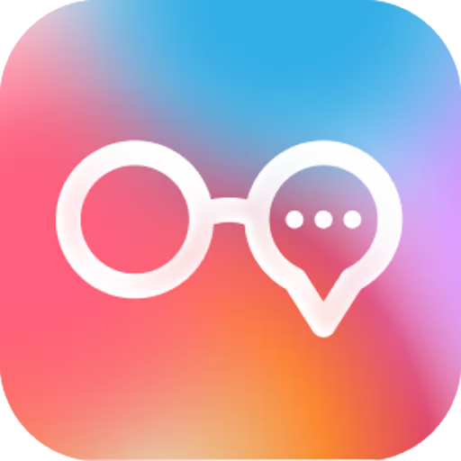

<p align="center">
  
</p>

<h1 align="center">Mentra Merge</h1>

<p align="center">
  <strong>Proactive conversation intelligence for smart glasses</strong>
</p>

<p align="center">
  Listens to conversations. Surfaces insights, definitions, and real-time data.<br/>
  Never interrupts. Always relevant.
</p>

<p align="center">
  <a href="https://apps.mentra.glass/package/com.mentra.merge">Install from Mentra MiniApp Store</a>
</p>

---

## What It Does

Merge is a proactive AI assistant that listens to your conversations through smart glasses and surfaces contextual insights on the HUD — definitions, fact-checks, nearby places, weather, web search results, and calculations.

- **Proactive insights** — Surfaces relevant information without being asked
- **Frequency modes** — Low, Medium, High control how often Merge speaks up
- **Places & Weather** — "Where can I get coffee?" or "What's the weather?"
- **Web search** — Real-time search for current events, prices, scores
- **Calculations** — "What's 20% tip on $67.50?"
- **Definitions** — Automatically defines acronyms and technical terms
- **Fact-checking** — Corrects false claims in real-time

## Getting Started

### Prerequisites

1. Install MentraOS: [get.mentraglass.com](https://get.mentraglass.com)
2. Install Bun: [bun.sh](https://bun.sh/docs/installation)
3. Set up ngrok: `brew install ngrok` and create a [static URL](https://dashboard.ngrok.com/)

### Register Your App

1. Go to [console.mentra.glass](https://console.mentra.glass/)
2. Sign in and click "Create App"
3. Set a unique package name (e.g., `com.yourName.merge`)
4. Enter your ngrok URL as "Public URL"
5. Add **microphone** and **location** permissions

### Run It

```bash
# Install
git clone <repo-url>
cd mentra-merge
bun install
cp .env.example .env

# Configure .env with your credentials
# PORT, PACKAGE_NAME, MENTRAOS_API_KEY (required)
# OPENAI_API_KEY (required - powers the AI agents)
# SERPAPI_API_KEY (required - web search)
# GOOGLE_MAPS_API_KEY (required - places & geocoding)
# GOOGLE_WEATHER_API_KEY (optional - falls back to GOOGLE_MAPS_API_KEY)

# Start
bun run dev

# Expose via ngrok
ngrok http --url=<YOUR_NGROK_URL> 3000
```

## Documentation

- [MentraOS Docs](https://docs.mentra.glass)
- [Developer Console](https://console.mentra.glass)

## License

MIT
